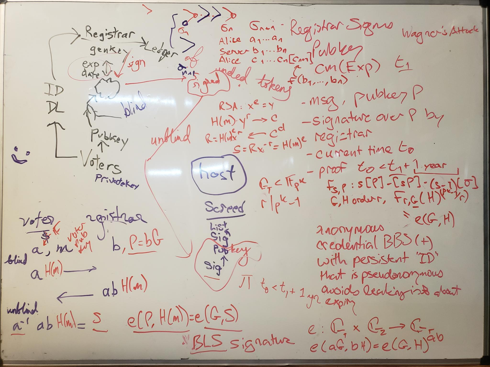

# `sps-counter`

<h2 align="center">
  
</h2>

<h3 align="center">Secure Polling System: Counter</h3>

-   Vite serves from public/ for static files that bypass the build process, while it serves from src/ for source files that are processed, bundled, and optimized during the build.
-   index.html is the entry point and it imports "/src/index.tsx" which is a processed and bundled version of the actual file src/index.tsx
-   /src/style.css styles the whole thing, served as /src/style.css which just quotes it escaped inside of const __vite__css which is imported into index.tsx

## Blinding
-   blinding using Schnorr is possible using libsodium but Schnorr requires a multi-step signing process which forbids concurrency, meaning the voter and registrar have to dance back and forth together before registrar can start dancing with someone else, lest the dancees collaborate to create an unearned signature https://nickler.ninja/slides/2018-bob.pdf see also https://github.com/jedisct1/libsodium/issues/831
-   pairing is required for the kind of blinding where there's no back-and-forth, but libsodium doesn't support pairing, so we might use ChainSafe which is very well reviewed https://github.com/ChainSafe/bls
-   There's also this https://www.npmjs.com/package/bls-signatures AKA https://github.com/Chia-Network/bls-signatures (in C++/Python and no longer maintained)
-   you have to modify the message by blinding it. That's what's happening on L178-180 here https://github.com/hammurabi-mendes/learn-crypto-javascript/blob/main/asymmetric-noble.mjs#L160-L207
-   see https://github.com/securepollingsystem/my-preact-app/pull/1/commits/01f75745e7cb0a10dca4ba54c6e25d600973a17e for complete implementation

## Getting Started

-   `npm run dev` - Starts a dev server at http://localhost:5173/

-   `npm run dev -- --port 8995 --host` - Starts a dev server at http://0:8995/

-   `npm run build` - Builds for production, emitting to `dist/`

-   `npm run preview` - Starts a server at http://localhost:4173/ to test production build locally
